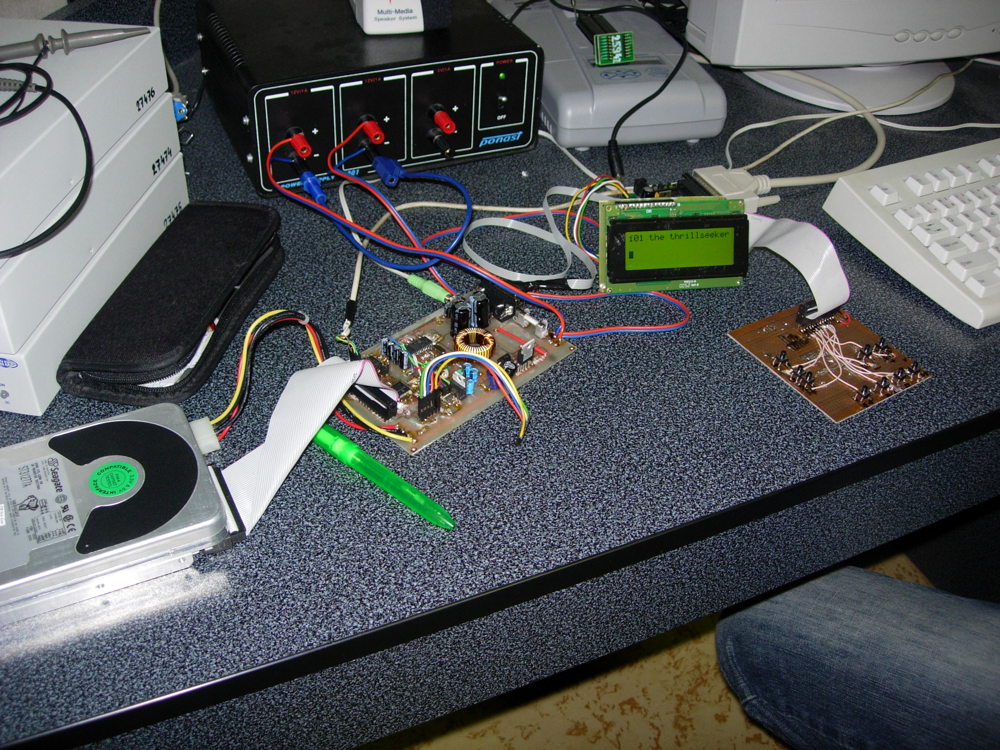
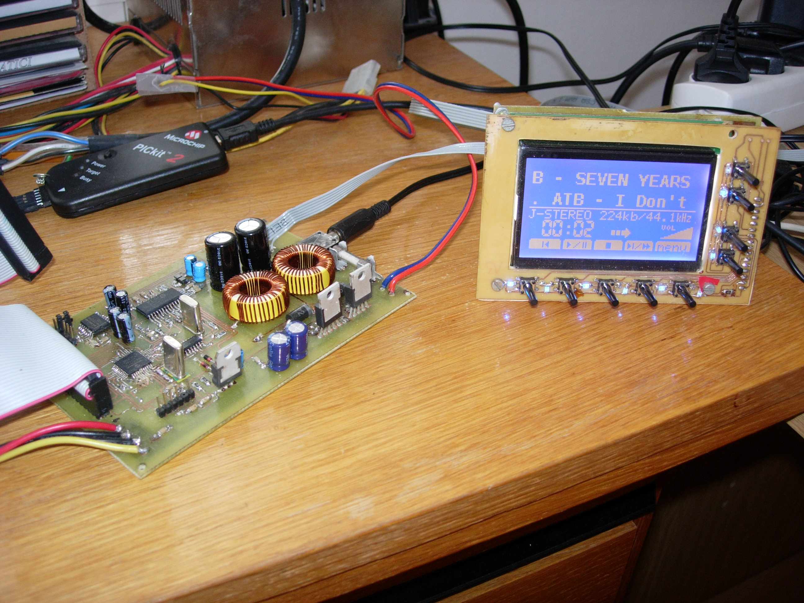

# HDD MP3 player

Archive repository for DIY MP3 player with ATA hardisk. 
This project is dead and not atively maintained, I publish it 
here on Github just to be available for indexing and to be reachable non-Czech speakers.

[Original webside](https://www.karry.cz/mp3_player/) (in Czech) with various materials, story, photos...

  
  

This is software part of my highshcool project for microprocessor course.
It was created in year 2005 when cheap mobile phones was unable to play music, 
portable mp3 players has usual memory 128 MiB and having mp3 player with 20 GiB 
of storage was a dream of many of us.

So, I created harware with two [PIC 16F877A](https://www.microchip.com/en-us/product/pic16f877a)
microprocessors and mp3 decoder on chip [VS1001k](https://www.vlsi.fi/en/products/vs1001.html)
that was able read files from ATA discs with FAT32 filesystem and play them.

 - first PIC microprocessor was connected to HDD via ATA bus
   and via serial SPI bus to the VS1001k ("execution" part)
 - it was able use hard-drives with LBA28 or LBA48 addressing,
   and read FAT32 filesystem - maximum partition size is 2 TiB. 
 - second PIC microprocessor was connected to LCD display and keyboard ("command" part)
 - two PIC microprocessor was communicating via UART (serial protocol)
 - there was two variants of "command" part, first was used small 
   text-based LCD, second variant used 
 - "execution" part and first variant of "command" part was written in assembler,
   second variant of "command" part was written in C partially.
